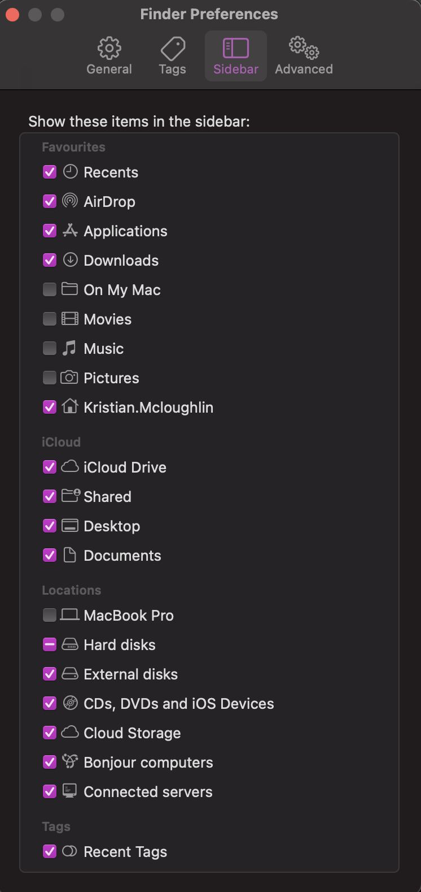

# Macbook Pro dotfiles and setup

This repository contains everything to bootstrap my Macbook Pro (16 inch, 2021). This setup has been heavily inspired by [Michael Friedrich ](https://gitlab.com/dnsmichi/dotfiles) and his guide [dotfiles - Document and automate your Macbook setup](https://about.gitlab.com/blog/2020/04/17/dotfiles-document-and-automate-your-macbook-setup/), and also this [guide](https://engineeringwith.kalkayan.io/series/developer-experience/storing-dotfiles-with-git-this-is-the-way/). The current ZSH theme is a custom theme built off the oh-my-zsh theme [geoffgarside](https://github.com/ohmyzsh/ohmyzsh/blob/master/themes/geoffgarside.zsh-theme).

In addition to the files stored in this repository, the following instructions are needed to fully setup my Macbook Pro.

Please be aware these scripts/MacOS settings/applications are all tailored for KrisM4c, so please check all options before applying to your own machine! :D I accept no responsibility for any issues that occur due to negligence of checking over the options being set! This repo can be used as a guideline for creating your own Dotfiles!

## Preparations

### VARIABLES TO CHANGE

As this repository has been sanitised, i have replaced items that will need replacing with you own information! Please see below for all of the variables to update throughout this repository to fit to your needs:

```
<FULL_NAME>
<COMPANY_EMAIL>
<COMPANY_NAME>
<GITHUB_USERNAME>
<GITHUB_EMAIL>
<MAC_USERNAME>
<GITHUB_REPO_OWNER>
<ACCESS_KEY_ID>
<SECRET_ACCESS_KEY>
<NONPROD_GCP_PROJ>
<PROD_GCP_PROJ>
```

### iterm2
Install it manually from the [website](https://iterm2.com/downloads.html), start it and add it to the deck.

Initial settings:

- Import my profile from `./item2/profiles/KrisM4c.json`.
- Mark `KrisM4c` profile and select `Other Actions > Set as default`.

### Git (XCode)
Install it on the command line first, it will ask for permission.

```bash
xcode-select --install
```

### PAT Token

Generate a token [here](https://github.com/settings/tokens) with: 

```yaml
tokenName: dotfiles
expiration: 1 day
onlySelectedRepositories: `dotfiles`
permissions:
  - group: Repository Permissions
    name: Contents
    access: Read-Only
```

Save the token as an env var:

```bash
export TOKEN=<TOKEN_HERE>
```

## Mac Setup

### Dotfiles Setup

To get the dotfiles synched and setup:

1. Head to the [dotfiles-setup script](https://github.com/<GITHUB_REPO_OWNER>/dotfiles/blob/main/.scripts/0-dotfiles-setup)
2. Click on the `Raw` button
3. Copy the URL and run the following command

```bash
curl -fsSL <URL_HERE> | bash
```

This should setup the dotfiles correctly, and backup any existing files to ~/.dotfiles-backup/

#### Tracking new .dotfiles
To track new .dotfiles, you can run the following commands:

```bash
dotf add ~/some-folder/some-file
dotf status # (or dotfst)
dotf commit -m "add some-file" # (or dotfc "comment")
dotf push # (or dotfp)
```

### Brew

Using the script in `.scripts/1-brew-setup`, it will install brew silently, and then install all the required packaged in the `Brewfile`.

```bash
~/.scripts/1-brew-setup
```

This makes use of the [Brewfile](Brewfile) definitions.

[mas](https://github.com/mas-cli/mas) is used to install apps from the app store, and is itself installed with Homebrew first in the [Brewfile](Brewfile).

```bash
$ cat ~/.scripts/mac-setup-files/brew/Brewfile

brew "mas"
...
mas "1Password 7", id: 1333542190
```

### Sudo
Note: I keep this disabled for improved security, though some sessions may require heavy sudo usage. This is actioned as part of the MacOS setup.

```bash
sudo vi /private/etc/sudoers.d/<MAC_USERNAME>

#<MAC_USERNAME>  ALL=(ALL) NOPASSWD: ALL
```

### SSH Keys
With Bitwarden that has been downloaded, get the SSH keys and put them in `~/.ssh`.

### MacOS setup

Setting up the MacOS preferences and OS settings, the following command can be ran:

```bash
~/.scripts/2-macos-setup
```

This will also setup the MacOS dock, so ensure that the `Brew` segment is completed first to allow this to work as expected.

## Essentials

These tools are managed outside of Homebrew, and require additional work and documentation.

### Tools

#### myrepos
NOTE: This is handled my the MacOS Setup script

Using mr, you can manage lots of github repos through single commands which makes mass updating a breeze. The config is handled by the .mrconfig file that sits in the parent directory of where you want your files to sit. The following will create and copy the mr configs to the correct locations:

```bash
~/.scripts/3-mr-setup
```

This creates directories according to what MyRepos configurations exist. 

To update all work related repos:

```bash
upd-git
```

To update all personal related repos:

```bash
upd-git-personal
```

If you require to update the list of what you require to pull, it can be found in `~/src/<PERSONAL||WORK>/.mrconfig`. To ensure these are up to date on the repo, these are located in [.scripts/mac-setup-files/mr](https://github.com/<GITHUB_REPO_OWNER>/dotfiles/tree/main/.scripts/mac-setup-files/mr)

<!-- #### Raycast Extensions

- [Emoji search](https://www.raycast.com/FezVrasta/emoji) for [fast emoji access](https://about.gitlab.com/handbook/marketing/community-relations/developer-evangelism/social-media/#fast-emojis-workflows)
- [GitLab](https://www.raycast.com/tonka3000/gitlab)
- [Weather](https://www.raycast.com/tonka3000/weather)
- [Speedtest](https://www.raycast.com/tonka3000/speedtest) -->

## Preferences

These are manual settings as they require user awareness.

<!-- ### Keyboard

`Shortcuts`: Disable Spotlight in preparation for enabling Raycast as default shortcut using `cmd + space`.

### Raycast

Start Raycast from the Applications folder, and change the hotkey to `Cmd+Space`.
Ensure that Spotlight is disabled in the system preferences. -->

### Finder

`Preferences > Sidebar` and add



### Homebrew

* Wireshark

## Additional Hints

More insights can be found in these lists:

- [Setting examples](https://github.com/mathiasbynens/dotfiles/blob/master/.macos)
- [command overview](https://github.com/herrbischoff/awesome-macos-command-line).


## Upgrades

On major version upgrades, binaries might be incompatible or need a local rebuild. 
You can enforce a reinstall by running the two commands below, the second command
only reinstalls all application casks.

```bash
brew reinstall $(brew list)

brew reinstall $(brew list --cask)
```

When Xcode and compilers break, re-install the command line tools.

```bash
sudo rm -rf /Library/Developer/CommandLineTools
sudo xcode-select --install
```
